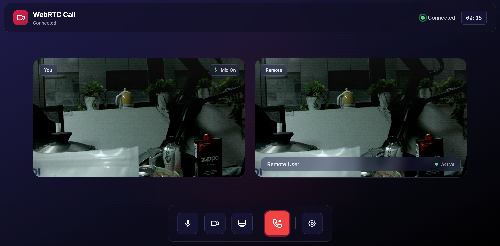

# 从0开始AI Agent开发（面向有经验程序员）

## 学习步骤

1. 原始 HTTP API 调用云端大模型 → 2. OpenAI SDK → 3. 本地部署 7B 模型 → 4. LangChain → 5. LangGraph 状态机 → 6. Skills 配置驱动

## 版本对比

| 版本 | 技术栈 | 特点 | 推荐场景 |
|------|--------|------|----------|
| test.js | 原生 fetch | 无依赖，手动 SSE | 学习原理 |
| test2.js | OpenAI SDK | 代码简洁 | 快速开发 |
| test3.js | LangChain | 流式工作示例 | 学习流式 |
| test4.js | LangChain | 自动化框架+长期记忆 | 生产环境 |
| test5.js | LangChain+LangGraph | 状态机驱动Agent | 复杂流程 |
| test6.js | LangChain | Skill技能框架，易扩展 | 多功能场景 |
| test7.js | LangChain+Expert Skills | 工业级技能架构，支持MD/脚本/SOP | 复杂生产环境 |

## 最新：test7.js 核心特性

`test7.js` 引入了全新的 **Expert Skills (专家级技能)** 架构，实现了“描述”与“执行”的完美分离：

- **一技能一目录**：每个技能拥有独立子目录（如 `agent_skills/web-search/`），包含 `SKILL.md` 指南和 `scripts/` 实现脚本。
- **Markdown 专家规程**：通过 MD 定义元数据和 SOP，AI 会先阅读“说明书”再干活。
- **混合型加载**：同时支持本地 `agent_skills/` 和下载的 `.agents/skills/`（兼容 https://skills.sh ）。
- **智能知识调度**：  
  - **按需读取**：即渐进式加载，启动时只加载描述，需要时加载技能；有子目录中附加技能链接时，按需读取。
- **自主脚本执行**：AI 能够识别文档中的 Usage Example 并通过 `execute_command` 自动运行 Shell/Python 脚本。

！甚至已经具备一个mini claude code编程助手的雏形（浏览网页，创建目录，生成并写入代码，执行npm安装指令，运行检查命令……）。

## 快速开始...

```bash
npm install
export OPENAI_API_KEY="your-api-key"
export MODEL="gpt-4-turbo"
export BASE_URL="https://api.openai.com/v1"

#测试不同test代码功能
node testX.js

# 安装外部技能依赖：（浏览器支持）
npm install -g playwright
npx playwright install
npm install -g @playwright/cli

# 安装外部技能 (自动下载到 .agents/skills/)
npx skills add https://github.com/nextlevelbuilder/ui-ux-pro-max-skill --skill ui-ux-pro-max
npx skills add microsoft/playwright-cli@playwright-cli

node test7.js
```

**示例1：（调用skills.sh上的ui-ux-pro-max技能设计一个web界面）**
- 识别意图是“设计”软件界面
- 调用ui-ux-pro-max技能
- 调用execute_command技能执行ui-ux-pro-max技能的script脚本search.py查找设计要素
- 执行ui-ux-pro-max技能的script脚本design_system.py输出设计规范
- 调用write_file技能保存输出的html或js等web内容
- 根据需要调用execute_command创建目录、列出目标目录下文件来检查结果

注意：测试使用kimi k2.5，太小的模型可能不能正确识别意图和执行复杂技能，可能导致异常结果甚至错误删除文件！



```
node test7.js
🚀 MbAgent
可用工具: calculate, check_camera, code-review, execute_command, get_cameras, get_current_time, get_weather, playwright-cli, read_file, system-info, ui-ux-pro-max, write_file


User: 设计并生成一个webrtc界面,使用tailwindcss和alpine新版本实现,完成后浏览器打开生成的html页面测试并给出结果

[🔧 Tool: ui-ux-pro-max]
Input: "{\"context\":\"设计并创建一个WebRTC视频通话界面，要求：\\n1. 使用Tailwind CSS CDN最新版本\\n2. 使用Alpine.js CDN最新版本\\n3. 功能包括：本地视频预览、远程视频显示、开始/结束通话按钮、静音/取消静音、开启/关闭摄像头\\n4. 现代化UI设计，使用glassmorphism风格\\n5. 响应式布局，支持移动端\\n6. 深色主
[✅ Done]

[🔧 Tool: execute_command]
Input: "{\"command\":\"python3 skills/ui-ux-pro-max/scripts/search.py \\\"webrtc video call dark glassmorphism modern\\\" --design-system -p \\\"WebRTC Video Call\\\"\"}"

……
```
更多日志：[日志](./test_logs/uiuxSkillDemo.txt)。


其它示例：(调用浏览器playwright检索网页)：
```
node test7.js
User: 百度搜索tailwindcss最新版本号
[🔧 Tool: execute_command]

[Exec] ls -la .agents/skills/playwright-cli/

[🔧 Tool: read_file]

[🔧 Tool: execute_command]

[Exec] playwright-cli open https://www.baidu.com

[🔧 Tool: execute_command]

[Exec] playwright-cli type "tailwindcss"

[🔧 Tool: execute_command]

[Exec] playwright-cli press Enter

[🔧 Tool: execute_command]

[Exec] playwright-cli snapshot

[🔧 Tool: read_file]

[🔧 Tool: execute_command]

[Exec] playwright-cli goto https://tailwindcss.com

[🔧 Tool: execute_command]

[🔧 Tool: read_file]

[🔧 Tool: execute_command]

[Exec] playwright-cli close


✨ Result:
根据我在百度搜索并访问 Tailwind CSS 官方网站的结果，找到了最新版本信息：

## Tailwind CSS 最新版本

### v4.2

从 Tailwind CSS 官方网站（tailwindcss.com）可以看到当前版本显示为 **v4.2**。

其他搜索结果中也提到了：
- 百度百科：提到 "2025年1月22日发布v4.0版本进行性能优化与配置重构"
- GitHub：显示最新版本为 v3.0.24（这是 v3 系列的最新版本）

**总结**：Tailwind CSS 目前最新的稳定版本是 **v4.2**（这是 v4 大版本系列），而 v3 系列的最新版本是 v3.0.24。v4 系列相比 v3 有重大更新，包括性能优化和配置重构。
```

**添加自定义技能（test7.js支持）：**

1. 创建技能目录：`mkdir -p agent_skills/my-skill/scripts`
2. 编写实现脚本 `agent_skills/my-skill/scripts/run.js`:
```javascript
export async function run({ param1 }) {
  return `执行结果: ${param1}`;
}
```
3. 编写专家指南 `agent_skills/my-skill/SKILL.md`:
```markdown
---
name: my-skill
description: 描述该技能的功能，供 AI 判断何时调用
---
# 使用指南
当你使用此技能时，请确保参数格式正确。
### Usage Example
```bash
node agent_skills/my-skill/scripts/run.js "测试数据"
```
```

## 技术栈

- LangChain v1.2 / LangGraph - Agent 框架
- @langchain/openai - OpenAI 模型
- Zod - 参数校验
- js-yaml - YAML 解析
- ffprobe - RTSP 流检测

## 调试

出错异常时，清除faiss_db目录重新运行，避免历史会话记录干扰当前会话。

```bash
ffprobe -v error -show_entries stream=codec_name,codec_type rtsp://url

node -e "import('./skills_v3.js').then(m => console.log(m.default.manifest.skills))"
```

## License

MIT